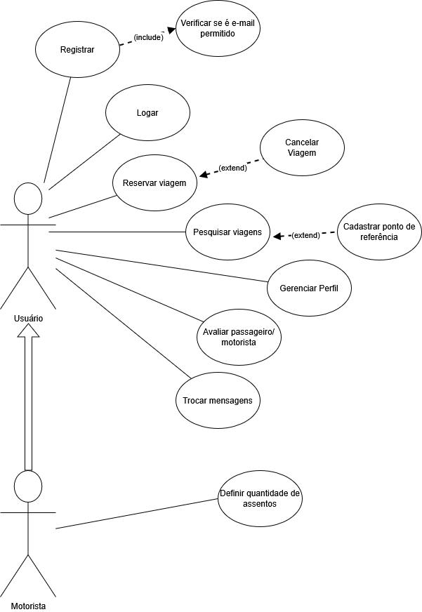

# Especificação do projeto

Pré-requisitos: <a href="01-Contexto.md"> Documentação de contexto</a>

Definição do problema e ideia de solução a partir da perspectiva do usuário. É composta pela definição do  diagrama de personas, histórias de usuários, requisitos funcionais e não funcionais além das restrições do projeto.

Apresente uma visão geral do que será abordado nesta parte do documento, enumerando as técnicas e/ou ferramentas utilizadas para realizar a especificações do projeto.

## Personas

Exemplo: _Pedro Paulo tem 26 anos, é arquiteto recém-formado e autônomo. Pensa em se desenvolver profissionalmente por meio de um mestrado fora do país, pois adora viajar, é solteiro e sempre quis fazer um intercâmbio. Está buscando uma agência que o ajude a encontrar universidades na Europa que aceitem alunos estrangeiros.

### ***Paulo é um estudante universitário de 19 anos atualmente cursando Análise e Desenvolvimento de Sistemas.***
- Paulo gosta de jogar LoL e atualmente trabalha na área da logística, mas está procurando um estágio.
- Objetivos: Conseguir voltar da faculdade para casa com mais facilidade.
- Necessidades: Ter uma opção segura e confiável para se deslocar para casa, além de economizar o tempo que ficaria no ponto de ônibus.

### ***Maria é uma professora de 32 anos.***
- Maria é extrovertida e gosta muito de conversar, além disso ela não gosta de ficar sozinha.
- Objetivos: Achar uma companhia para quando estiver voltando de carro da faculdade.
- Necessidades: Um sistema que a auxilie em achar pessoas que precisam de carona.

### ***Victor é um aluno de 27 anos, cursando Sistemas de Informação na PUC.***
- Victor gosta de sair para baladas e viver novas experiências, além disso Victor recentemente comprou um carro.
- Objetivos: Oferecer caronas para outros alunos, professores ou colaboradores da PUC ajudando a reduzir os custos com combustível e criando uma rede de apoio entre os colegas.
- Necessidades: Encontrar passageiros com trajetos semelhantes que compartilhem os custos da viagem de maneira justa.

### ***Fernanda é uma colaboradora de 35 anos, do administrativo da PUC Minas.***
- Fernanda tem a agenda apertada devido a vida profissional e pessoal, ela gosta de conhecer pessoas.
- Objetivos: Conseguir uma carona para voltar para casa após o trabalho na PUC de forma eficiente e econômica.
- Necessidades: Otimizar seu tempo e reduzir os custos diários com transporte.

### ***Larissa Silva é uma aluna de 19 anos que cursa Psicologia na PUC.***
- Larissa é solitária e gosta de interagir com outras pessoas, além disso ela é organizada mas tem horários de aula irregulares
- Objetivos: Conseguir uma carona para voltar para casa de forma mais rápida e que seja compatível com seu horário de aula irregular.
- Necessidades: Um sistema que permita escolher entre caronas que respeitem sua rotina e horários de aula.

> **Links úteis**:
> - [Rock content](https://rockcontent.com/blog/personas/)
> - [Hotmart](https://blog.hotmart.com/pt-br/como-criar-persona-negocio/)
> - [O que é persona?](https://resultadosdigitais.com.br/blog/persona-o-que-e/)
> - [Persona x público-alvo](https://flammo.com.br/blog/persona-e-publico-alvo-qual-a-diferenca/)
> - [Mapa de empatia](https://resultadosdigitais.com.br/blog/mapa-da-empatia/)
> - [Mapa de stalkeholders](https://www.racecomunicacao.com.br/blog/como-fazer-o-mapeamento-de-stakeholders/)
>
Lembre-se que você deve ser enumerar e descrever precisamente e personalizada todos os clientes ideais que sua solução almeja.

## Histórias de usuários

Com base na análise das personas, foram identificadas as seguintes histórias de usuários:

|EU COMO...          | QUERO/PRECISO ...                  |PARA ...                                |
|--------------------|------------------------------------|----------------------------------------|
|Estudante/Colaborador que precisa de transporte|Pesquisar motoristas disponíveis com trajetos compatíveis|Encontrar uma carona conveniente e economizar no deslocamento|
|--------------------|------------------------------------|----------------------------------------|
|Estudante/colaborador que tem carro|Oferecer caronas para outros alunos/colaboradores|Dividir os custos do combustível e contribuir com a mobilidade sustentável|
|--------------------|------------------------------------|----------------------------------------|
|Estudante/Colaborador|Agendar uma carona com antecedência|Planejar melhor meu deslocamento e evitar imprevistos|
|--------------------|------------------------------------|----------------------------------------|
|Passageiro| Avaliar os motoristas e as caronas que participei|Ajudar a manter um ambiente seguro e confiável na plataforma|
|--------------------|------------------------------------|----------------------------------------|
|Usuário da plataforma|Acessar um histórico das minhas caronas passadas|Visualizar com quem já viajei e manter contato com motoristas confiáveis|
|--------------------|------------------------------------|----------------------------------------|
|Estudante/Colaborador da PUC|Me cadastrar e fazer login utilizando meu e-mail institucional|Quero me cadastrar e fazer login utilizando meu e-mail institucional|
|--------------------|------------------------------------|----------------------------------------|
|Passageiro|Receber notificações sobre o status da minha carona (confirmação, cancelamento, lembretes)|Estar sempre informado sobre mudanças no meu trajeto|
|--------------------|------------------------------------|----------------------------------------|
|Motorista|Definir preferências, como horário, número de passageiros e regras da viagem|Garantir que a carona ocorra de forma confortável e organizada|
|--------------------|------------------------------------|----------------------------------------|
|Motorista|Que os passageiros confirmem sua presença antes da carona|Evitar desistências de última hora e melhor planejar a viagem|
|--------------------|------------------------------------|----------------------------------------|
|Usuário da plataforma|Poder conversar com motoristas e passageiros antes da viagem|Combinar detalhes e esclarecer dúvidas sobre o trajeto|

## Requisitos

As tabelas a seguir apresentam os requisitos funcionais e não funcionais que detalham o escopo do projeto. Para determinar a prioridade dos requisitos, aplique uma técnica de priorização e detalhe como essa técnica foi aplicada.

### Requisitos funcionais

|ID    | Descrição do Requisito  | Prioridade |
|------|-----------------------------------------|----|
|RF-001| Permitir que o usuário se cadastre utilizando o e-mail da instituição | ALTA | 
|RF-002| Permitir que o usuário cadastre um ponto de referência para facilitar a localização de embarque   | ALTA |
|RF-003| Permitir que o motorista cadastre um ponto de referência para facilitar o encontro com o passageiro | ALTA | 
|RF-004| Permitir que o passageiro cancele a carona antes do início da viagem   | ALTA |
|RF-005| Permitir que o passageiro confirme a reserva da carona antes do início da viagem | ALTA | 
|RF-006| Permitir que o usuário cadastre uma viagem com informações de origem e destino  | ALTA |
|RF-007| Permitir que o usuário pesquise viagens disponíveis com base em origem ou destino	 | ALTA | 
|RF-008| Permitir que o usuário envie mensagens para o motorista ou passageiro sobre a viagem   | ALTA |
|RF-009| Permitir que o usuário se cadastre e crie um perfil com informações pessoais, como nome, telefone e foto  | ALTA |
|RF-010| Permitir que o motorista defina o número de assentos disponíveis para a viagem | MÉDIA | 
|RF-011| Exibir a avaliação do motorista e do passageiro com base em avaliações anteriores   | ALTA |

### Requisitos não funcionais

|ID     | Descrição do Requisito  |Prioridade |
|-------|-------------------------|----|
|RNF-001| O sistema deve ser responsivo, funcionando adequadamente em dispositivos móveis | ALTA | 
|RNF-002| O sistema deve processar as requisições de busca de viagens em até 2 segundos |  BAIXA |
|RNF-003| O aplicativo deve ser compatível com as versões mais recentes do Android e iOS | ALTA | 
|RNF-004| O aplicativo deve ser capaz de suportar até 100 usuários simultâneos |  BAIXA | 
|RNF-005| O sistema deve ter alta disponibilidade, com tempo de inatividade inferior a 1% | MÉDIA | 
  

Com base nas histórias de usuários, enumere os requisitos da sua solução. Classifique esses requisitos em dois grupos:

- [Requisitos funcionais
 (RF)](https://pt.wikipedia.org/wiki/Requisito_funcional):
 correspondem a uma funcionalidade que deve estar presente na
  plataforma (ex: cadastro de usuário).
- [Requisitos não funcionais
  (RNF)](https://pt.wikipedia.org/wiki/Requisito_n%C3%A3o_funcional):
  correspondem a uma característica técnica, seja de usabilidade,
  desempenho, confiabilidade, segurança ou outro (ex: suporte a
  dispositivos iOS e Android).

Lembre-se de que cada requisito deve corresponder a uma e somente uma característica-alvo da sua solução. Além disso, certifique-se de que todos os aspectos capturados nas histórias de usuários foram cobertos.

> **Links úteis**:
> - [O que são requisitos funcionais e requisitos não funcionais?](https://codificar.com.br/requisitos-funcionais-nao-funcionais/)
> - [Entenda o que são requisitos de software, a diferença entre requisito funcional e não funcional, e como identificar e documentar cada um deles](https://analisederequisitos.com.br/requisitos-funcionais-e-requisitos-nao-funcionais-o-que-sao/)

## Restrições

|ID| Restrição                                             |
|--|-------------------------------------------------------|
|001| O projeto deverá ser entregue até o final do semestre. |
|002| A equipe não pode subcontratar o desenvolvimento do trabalho. |
|003| Toda a documentação do projeto deve ser entregue completa e atualizada.  |
|004| Não pode faltar nenhum requisito funcional previamente declarado.  |

## Diagrama de casos de uso

